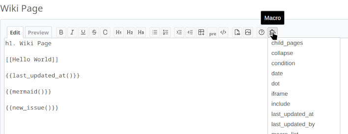
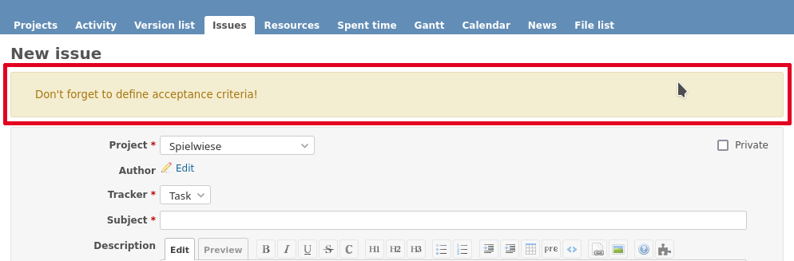
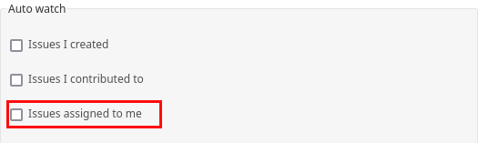
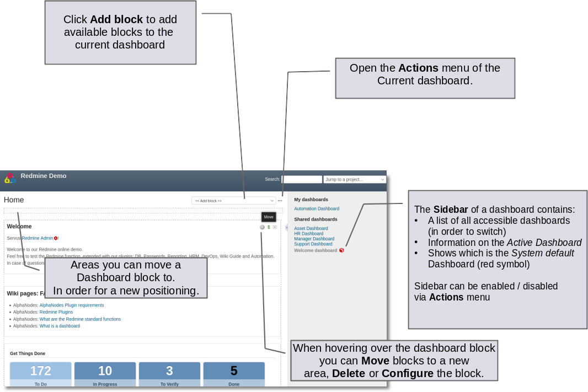

# Welcome to Additionals Plugin for Redmine

Additionals is a `Redmine` plugin for customizing Redmine, providing wiki macros and act as a library/function provider for other Redmine plugins.

* Redmine.org plugin page: <https://www.redmine.org/plugins/additionals>
* Github: <https://github.com/alphanodes/additionals>

[](https://www.redmine.org/plugins/additionals) [](https://github.com/alphanodes/additionals/actions?query=workflow%3A%22Run+Linters%22) [](https://github.com/alphanodes/additionals/actions?query=workflow%3ATests)

## Requirements

| Name               | requirement                      |
| -------------------|----------------------------------|
| `Redmine` version  | >= 5.0                           |
| `Ruby` version     | >= 3.0                           |
| Database version   | MySQL >= 8.0 or PostgreSQL >= 10 |

> **_NOTE:_** If you use MySQL, make sure all database tables using the same storage engine (InnoDB is recommended) and character set (utf8mb4 is recommended).

> **_NOTE:_** For more information use the official [Redmine install documentation](https://www.redmine.org/projects/redmine/wiki/RedmineInstall)

## Installation

Install `additionals` plugin for `Redmine`.

```shell
  cd $REDMINE_ROOT
  git clone -b stable https://github.com/alphanodes/additionals.git plugins/additionals
  bundle config set --local without 'development test'
  bundle install
  bundle exec rake redmine:plugins:migrate RAILS_ENV=production
```

Restart your application server (apache with passenger, nginx with passenger, unicorn, puma, etc.) and *Additionals* is ready to use.

More information about installation of Redmine plugins, you can find in the official [Redmine plugin documentation](https://www.redmine.org/projects/redmine/wiki/Plugins>).

## Update

Update *additionals* plugin.

```shell
  cd $REDMINE_ROOT/plugins/additionals
  git pull
  cd ../..
  bundle install
  bundle exec rake redmine:plugins:migrate RAILS_ENV=production
```

Restart your application server (apache with passenger, nginx with passenger, unicorn, puma, etc.) and `additionals` is ready to use.

## Uninstall

Uninstall `additionals` plugin.

```shell
  cd $REDMINE_ROOT
  bundle exec rake redmine:plugins:migrate NAME=additionals VERSION=0 RAILS_ENV=production
  rm -rf plugins/additionals public/plugin_assets/additionals
```

## Features

* Dashboard (Drag&Drop) Support
* Text for login page
* Global footer for all projects
* Welcome text for login page
* Global sidebar content support
* Note for new issues above issue content (e.g. for guidelines)
* PDF for wiki pages
* Wiki macros for:

  * asciinema
  * cryptocompare
  * date
  * fa
  * gihub gist
  * google_docs
  * gmap
  * group_users
  * iframe
  * last_updated_at
  * last_updated_by
  * members
  * meteoblue
  * new_issue
  * projects
  * recently_updated
  * reddit
  * redmine.org issue and wiki page (redmine_issue and reminde_wiki)
  * slideshare
  * tradingview
  * twitter
  * user
  * vimeo
  * youtube

* macro list with all available macros at /help/macros included documentation
* macro button for wiki toolbar with available macros with project and permission context support
* option to remove "Help" from top menu
* disable (hide) modules for projects
* open external urls in new window
* smiley/emoji legacy support
* anonymize referrer for external urls
* hide role in project memberbox
* limitation of the number of attachments that are displayed as a preview in the issue
* Auto watch option *Issues assigned to me*
* change issue author
* create issue on user profile
* "assign to me" link on issue
* change issue state on sidebar
* configurable issue rules

  * freeze closed issue
  * change assigned_to automatically, if issue status changes
  * assigned_to has changed, but status change is required, too

> **_NOTE:_**  We reserve the right to remove certain functions again. This is the case, for example, if a function has been included in Redmine Core or conflict with it.

## Developer features

As Redmine does not support asset pipeline, we need to install Javascript plugins as Redmine plugins to load them globally.

If no common files are used as library plugin, every plugin has to deliver the same files. And if more
than one version of a library is delivered with each Redmine plugin, there is a problem.

Therefore if developer uses this plugin for the provided libraries, everything works smoothly.
Don't worry, if you only need a subset of the provided libraries. If you do not load a library, it is not used.

It provides :

* [Chart.js Plugin annotation 2.1.2](https://github.com/chartjs/chartjs-plugin-annotation)
* [Chart.js Plugin colorschemes 0.4.0 (patched for chartjs 3)](https://github.com/nagix/chartjs-plugin-colorschemes)
* [Chart.js Plugin datalabels 2.1.0](https://github.com/chartjs/chartjs-plugin-datalabels)
* [Chart.js Plugin matrix 2.0.1](https://github.com/kurkle/chartjs-chart-matrix)
* [clipboardJS 2.0.11](https://clipboardjs.com/)
* [d3 7.9.0](https://d3js.org/)
* [d3plus 2.0.3](https://d3plus.org/)
* [FontAwesome 5.15.4](https://fontawesome.com/)
* [mermaid 9.3.0](https://github.com/mermaid-js/mermaid)
* [moment 2.29.4](https://github.com/moment/moment) (used by Chart.js)
* [Select2 4.0.13](https://select2.org/)

And a set of various Rails helper methods (see below).

It provides the following Rails helper methods :

## Libraries assets loader

```ruby
   additionals_library_load(module_name)
```

This method loads all JS and CSS files needed by the required module.

The following modules are available :

* chartjs
* chartjs_colorschemes
* chartjs_datalabels
* clipboardjs
* d3
* d3plus
* font_awesome
* mermaid
* select2

### Redmine Plugins, which are using *additionals*

* [additional_tags](https://github.com/alphanodes/additional_tags)
* [redmine_automation](https://alphanodes.com/redmine-automation)
* [redmine_db](https://alphanodes.com/redmine-db)
* [redmine_devops](https://alphanodes.com/redmine-devops)
* [redmine_git_hosting](http://redmine-git-hosting.io/)
* [redmine_hedgedoc](https://github.com/alphanodes/redmine_hedgedoc)
* [redmine_hrm](https://alphanodes.com/redmine-hrm>)
* [redmine_omniauth_saml](https://github.com/alphanodes/redmine_saml)
* [redmine_passwords](https://alphanodes.com/redmine-passwords)
* [redmine_issue_view_columns](https://github.com/alphanodes/redmine_issue_view_columns)
* [redmine_privacy_terms](https://github.com/alphanodes/redmine_privacy_terms)
* [redmine_reporting](https://alphanodes.com/redmine-reporting)
* [redmine_servicedesk](https://alphanodes.com/redmine-servicedesk)
* [redmine_sudo](https://github.com/alphanodes/redmine_sudo)
* [redmine_wki_guide](https://alphanodes.com/redmine-wiki-guide)

If you know other plugins, which are using *additionals*, please let us know or create a [PR](https://github.com/alphanodes/additionals/pulls).

## You need a feature

*additionals* is [Open-source](https://opensource.org/osd) and it is available at <https://github.com/alphanodes/additionals>

If you want to implement new features in it or if you want to change something, you can provide a pull request.

The plugin is maintained by [AlphaNodes](https://alphanodes.com) for free as far as possible. In case you want a feature, which is not available and you are not capable of implementing it yourself, you can request this feature from AlphaNodes.

We are an `Open-source`_ service company from Munich. Among other things, we offer commercial plugin development (e.g. implementation function request, expansion of functionality, etc).  As we know our plugin at its best we are glad to take this job from you. In case the requested plugin changes still fit to the plugin purpose. Please, contact us in case you are interested in commercial plugin development.

## Additionals plugin manual

The plugin configuration takes place in the administration area by a user with administration permission. Go to *Plugins / Additionals* to open it.

The additionals plugin configuration is divided into several sections, described below.

## General section

The general section tab allows you to define some special behaviours for your Redmine installation.

### Contents

The following plugin options are available to be edited by users with administration rights in the area **Contents**:

* Text for login page
  * This section is for a short information on the login page below the Redmine login mask. For example who to contact in order to get Redmine access.

* Global sidebar
  * Place your global information here, if needed. Use wiki links or available macros that can be seen by every one.

* Project wide footer
  * In case you want to put some information about your company or for your imprint. Here you can also use wiki syntax for structuring your text.

### Settings

And the following options can be edited by users with administratios rights in the area **Settings**:

- Open external URLs
  - Activate the option ``Open external URLs`` in order to open those URLs in a new window or browser tab if someone wants to visit them.

- Go to top Link
  - Add "Go to top" link. If you have a lot of long pages, it is enabling users to easily return to the top of a page.

- Emoji support
  - Activate this option if you want to convert emojis in text. For more info on Emoji-Browser support read [more here](http://caniemoji.com/). Have a look at the Emoji [cheat sheet](https://www.webpagefx.com/tools/emoji-cheat-sheet) for available Emoji-Codes.
  
- Legacy smileys support
  - Activate the ``Legacy smileys support`` if you want to use the manual smiley code in your text (e.g. ``:)``). If you already use a plugin that supports Smileys this option should stay deactivated. 

- Maximum number of LiveSearch results
  - This option only affects plugins, that support LiveSearch. If you enter a value here, the LiveSearch results will be limited by the entered value.

### Disable modules

This feature will hide the selected modules in the project settings. Even if the module is enabled for usage in the admin area it can not be selected by the project manager within the projects. Please note, if these modules already activated in existing projects, you will have to change and re-save the respective project settings first.

> **_NOTE:_**  Please restart the application server, if you make changes to the external urls settings as well as if you activate the Smileys support.

> **_Tip:_**  You can use the following manual smiley codes: :), =), :D, =D, :'(, :(, ;), :P, :O, :/, :S, :|, :X, :*, O:), >:), B), (!), (?), (v), (x) and  (/)

## Wiki section

If you click on this tab you get to the area, where users with administration rights can customize contents and settings for your Wiki pages in Redmine.

### Contents

Global wiki sidebar

* Here you can implement useful macros like a display of your page hierarchy. But remember - only people with the correspondent rights will get a display of the content.
* You can also implement useful macros in this section. For example to implement some date or author macros (e.g. last_updated_at, last_updated_by)

> **_NOTE:_**  Use simple text, macros and wiki syntax for your content.

### PDF Wiki settings

* Remove Wiki title from PDF view
  * When activated the general Wiki title info in the page header of the PDF view will not be displayed.

* Remove attachments from PDF view
  * When activated the attachments will not be displayed in the PDF view of a Wiki page.

## Macros section

Redmine macros can be used in the Wiki of a project or in the text area of an issue. For more information on how to add macros use the Redmine help documentation.

The *Macros section* of the additionals plugin lists all available macros that the logged in user can use with the *macro button* of the wiki toolbar. If you leave them deactivated they are all available to your users for selection.

Macros marked here are not offered for selection. This allows you to limit the scope of the list for a better usability.


*Figure: If all macros are deactivated the *Macro button* of the Wiki toolbar will disappear.*

> **_NOTE:_**  If you deactivate some macros here this does not mean the user may not implement them. All available macros of installed plugins will work even if they are not part of the macro button. The macro button is just a little helper for Redmine users with no macro experience to make it easier for them to use macros or to remember them.

### Macro button for Wiki toolbar

Many plugins are equipped with a number of useful macros. Unfortunately it is difficult for the normal user to find out which macros are usable without a look at the plugin documentation.

With the macro button for the Wiki toolbar we want to simplify the implementation of macros for users somehow and above all also promote. Because the use of macros belongs to the daily tools of the trade when dealing with the Wiki.



*Figure: The Wiki toolbar macro button is a useful helper in order to select available project macros for your content.*

The macro button for the Wiki toolbar is acessible for every user of a project. For reasons of clarity, the list of available macros is restricted according to the following criteria.

A user can see in the macro list:

* the macros that can be used for the respective area.
  Macros that only work in the wiki are not available in the issue area and vice versa.
* The macros, which he / she can use due to his / her role and the associated rights in the respective project.
* only the macros of modules activated in the project.
  Macros for deactivated functions are hidden in the list.

The function is easy to use. Just click the button with the left mouse. The dropdown list shows all your available macros. Select the one you want to use. The selected macro will be pasted to the cursor position. All you have to do is adapt missing parameters (if needed).

## Issues section

Here you can define issue rules, which are used in issues of all projects.

* Note for new issues
  * Use this section if you want to place important issue notes above every new issue (edit mode) like in the screenshot below. Keep it short and use a link to a common wiki page with further information.

  

> **_NOTE:_** You can use wiki syntax for your text (use it wisely). Make sure the wiki page you link to is accessible for every user. The default issue text can be overwritten within the project settings.

* Show max. files
  * Activate this option if you want to compress the display in the issue view for too many file attachments. If no value is entered, the user will be shown the standard view for Redmine files. If a value is stored, the "Files" section in the issue view will be collapsed if the value is exceeded.*

* New issue on user profile
  * Activate this option in case you want to display the symbol link *New issue* on a user's profile page in the top right corner in order to add a new issue for this user directly from it's user profile page.

* Show *Assign to me* on issue
  * Activate this option if you want to display the symbol link *Assign to me* in the issue overview page of an issue that you are able to assign it directly to yourself without *editing* the issue. The link is only shown to users who are also members in the correspondent project.

* Show issue author with note
  * Activate this option in order to see the *Author* label in notes of the issue author.

* Fast edit for description
  * Activate this option and an *Edit* link will be displayed in the issue view in the "Description" area so that only the description can be edited quickly.

* Issue status on sidebar
  * Activate this option in case you want to display a list of available issue status options in the right sidebar of the issue view page. One click on the option changes the issue status directly without opening the *edit* mode.

> **_NOTE:_** All options above only work for users with appropriate issue tracking rights in the administration area "Roles and permissions" (view, create, edit).

* Disallow editing of closed issues (Freeze).
  * This option should be activated if already closed issues should no longer be edited and commented.

If *Assignee* is unchanged and the issue status changed from x to y, than the author is assigned to the issue.
Issues should be automatically assigned to the author, if the status changes to *Approval*.


> **_NOTE:_** Use Case for this option is that issues should be automatically assigned to author, if the status changes to *Approval*.

Current issue status x is only allowed if *Assignee* is the current user.

> **_NOTE:_** Is this function used in combination with the setting option *Issue status on sidebar* then the current user will automatically be assigned to the issue while changing the issue status. Use Case here: Users are only allowed to change the status to *In Progress* if they are the person who is actually working on the issue right now.

If *Assigned to* is not assigned to a user and the new issue status is x then the issue is auto assigned to the first group with users of the pre-defined role.

> **_NOTE:_** Use Case: The issue author does not know whom the issue should be assigned to. Or he is unsure who will be responsible for solving the task. In that case the issue for example with the status "To Do" is automatically assigned to the first group, which does contain a user of the pre-selected project manager role. Imagine you have a group called "Support", and there are users assigend to the "Manager" role, this support group will be automatically adressed to solve the issue when the issue author saves it.

Time log for issues required.

> **_NOTE:_** For each issue of the selected trackers, a time logging is necessary if the issue is to receive one of the defined status properties. The time logging is not required if there does no rights exist for the creation of time logging or if the user has the authorization *Time logging not required*.

Please note, that a user with administration rights will always be able to do all those things a normal user is not allowed to.

## Web APIs section

In case you want to use the Gmap Macro you have to implement your Google API Key into the field ``Google Maps Embed API Key`` first. After this you can use the Macro everywhere inside Redmine (Wiki, Issues - everywhere you use wiki syntax).

## Help menu

We have implemented a help symbol in the global top menu of the header section that opens the new *help menu*.

There you find useful manual links to various Redmine related topics which will automatically be implemented, when the plugin has been installed. The menu is divided into two parts.

* There is a menu only for Redmine users without administration rights.
* There is a menu extension for Redmine users with administration rights.

The following menu items are currently implemented if a plugin is installed, that supports this additionals-function:

* FontAwesome Icons
* Redmine Macros (for more information see: Macros)
* Redmine Guide
* Redmine Changelog
* Redmine Security Advisories
* Redmine Upgrade

Known external plugins that have a user manual and support this feature are currently:

* additionals
* redmine_automation
* redmine_db
* redmine_devops
* redmine_hrm
* redmine_passwords
* redmine_privacy_terms
* redmine_reporting
* redmine_service_desk
* redmine_wiki_guide

## User account 

The following option has been added to the *Auto-watch* section in the user account:

* Issues assigned to me

If this option is activated, you will be set as a watcher based on the assignment. The aim is to be notified of changes even without prior interaction with the issue. For example, if the issue is assigned to another user in the meantime. 



## Plugin project settings

In the project configuration the ``Issues tracking``section allows you to store system wide ``Note for new issues``, which will be displayed on top of new issues (or in the edit mode of an issue). This system wide information text can be changed per project within the project settings. You can change the system settings in your project **Settings** area section **Issue tracking**.


Choose one of the following options:

| Name       | Description                                                                                  |
| -----------|----------------------------------------------------------------------------------------------|
| System     | There is nothing you can do. The default system wide text will be used.                      |
| disabled   | This disables the ``Note for new issues`` completely.                                        |
| Project    | This option allows you to define your own, project relevant text as ``Note for new issues``. |

> **_NOTE:_** You can use wiki syntax for your text (use it wisely). Make sure the wiki page you link to is accessible for every user. The default issue text can be overwritten within the project settings.

## Additionals permissions

The following role permissions are provided by the plugin and must be configured in the administration area ``Roles and permissions`` for the plugin functions to make sure it's working properly.

**According to the selected Role you can activate / deactivate the following option:**

* Hide
  * This option hides ``members`` of the selected role in the member box of each project overview page. Project members of other roles will still be listed. For example: You don't want others to catch a glimpse of your development team (Role: Development). So activate the role "Developer" to hide the list of your team members assigned to this role in this box. This function is also useful if your member box is too crowded.

> **_NOTE:_** This setting is also taken into account in all related query lists (e.g. issues, spent time etc.). So that the members with this role are also hidden there.
> **Important:** If the user has in one project a role, that allows him / her to view a specific "hidden role" this rule is not taken into account anymore.

**According to the selected Role you can activate / deactivate the following permissions:**

* Show hidden roles
  * Section Project. In case you have hidden roles in a project that should not be displayed in the member box for example you can give to some special user roles the permission to display the members however. *Important:* If someone in a project has a role that has this right, then this user sees all users everywhere even if he or she is user of another project with different roles.

* Save dashboards
  * Section Project. Allow this user role to add, edit or delete dashboards of their own. So this users can add dashboards for every purpose they want and switch between them.

* Set system dashboards
  * Section Project. This permission requires *Save dashboards* permission. If you activate it, you allow users with this permission to change the system wide dashboard. Those user may create dashboards and make them system default. They get additional options: *Visible*, *System default* and *Always expose*.

* Share dashboards
  * Section Project. Allow user roles with this permission to share dashboards with other users. This means if someone else assigns you a dashboard via *Author* selection, you are allowed to edit those dashboards as long as you are the assigned *Author* and also have the permission to *Save dashboards*.

* Edit issue author
  * Section Issue tracking. This permission will always record any changes made to the issue author. You can change the author only in the issue edit mode. This function replaces the use of external plugins (e.g. change_author)

* Edit closed issues
  * Section Issue tracking. Set this option to those roles you do not want to edit closed issues. Normally a closed issue should not be edited anymore.

* Set author of new issues
  * Section Issue tracking. This permission should be set carefully, because in case you allow this, there is no history entry set for this. You will never know if the author has been originally someone else. Normally you don't want this.

* Log time to closed issues
  * Section Time tracking. Our plugin does not allow time logs to closed issues. In case you still want to allow your members to log time to closed issues, you need to change the permission here.

## Dashboards

The additionals plugin comes with dashboard support (Drag & Drop). The *Dashboard* feature of the additionals plugin provides customizable areas to display and organize content from Redmine and Redmine plugins that support the functionality.

Specifically, you can customize the traditional Redmine main page, as well as the project overview pages according to your needs using the available dashboard blocks. The goal is to give the viewer an immediate overview of the issues or to display the metrics that are important to you.

The dashboard configuration takes place directly in Redmine:

* On the "Home" page
* On the Project overview page
* If other plugins are installed and support the dashboard functionality there might be also other areas. For example:

    * Redmine HRM Plugin: HRM overview page



*Figure shows the main areas of the dashboard function*

**Dashboard examples**

With the *Dashboard* of the *additionals* plugin for Redmine you can for example:

* design the Redmine main page or project overview page so that the information relevant to you is displayed there at a glance.
* create your own (private) dashboards independent of the predefined default dashboard and switch between them as needed.
* create dashboards for other users or specific roles. As well as share your own dashboards publicly and make them available to your team.

> **_NOTE:_** When using the dashboard function make sure you have already configured the *additionals permissions* the way you need them.

**Dashboard permissions**

If you want to use the dashboard functionality you need to configure the permissions for the respective user roles, which are:

* Save dashboards
* Set system dashboards
* Share dashboards

### Dashboard blocks

The following blocks are delivered as standard when using the additionals dashboard function.

General blocks for all areas (e.g. *Home* and *Project overview*) are:

* Query: Issues
  * You can configure the block content by selecting the *Issue Query* you want to display and choosing a number for *Maximum entries* to be displayed.
  * Maximum number of such blocks per dashboard: **8**

* Text
  * You can add individual text passages to your dashboard and use the wiki editor for structuring this text. If you want to work with macros, that include large amount of information (e.g. issue lists), use the *Text (asynchronous)* block instead, because it is cached asyncronous for 30 seconds due to performance reasons.
  * Maximum number of such blocks per dashboard: **8**

* Text (asynchronous)
  * This block is perfect if you want to implement macros into your text area. You can add individual text passages to your dashboard and use the wiki editor for structuring this text. Please note, that some macros are only usable in Wiki pages of a project, but not in issues or dashboard blocks. In that case no content will be displayed, but only the macro code.
  * Maximum number of such blocks per dashboard: **8**

* Latest news
  * Add the latest news block to your dashboard to show your user's what is going on in your system. The block configuration allows you to edit the number of *Maximum entries*.
  * Maximum number of such blocks per dashboard: **1**

* Documents
  * Add the *Documents* block to your dashboard to show your user's the latest documents, uploaded in Redmine. The block configuration allows you to edit the number of *Maximum entries*.
  * Maximum number of such blocks per dashboard: **1**

* Static spent time
  * Add the *Spent time* block to your dashboard to show the spent time activities. The block configuration allows you to edit the number of *Days* displayed in the block.
  * Maximum number of such blocks per dashboard: **1**

* Atom+RSS Feed
  * You can configure the block content by changing the *Title*, adding an *URL* and choosing a number for *Maximum entries* to be displayed.
  * Maximum number of such blocks per dashboard: **8**

Special blocks for the welcome page *Home* are:

* Standard content left / Standard content right
  * There are plugin developers who do not support our dashboard function and may have implement own content on the Redmine start page (legacy_left and legacy_right). These are usually not displayed due to the lack of dashboard support. If you still want to see this, select one of the two blocks or both for displaying such content.

* Activity
  * You can configure the activity block content by choosing a number for *Maximum entries* to be displayed. And in case you are only interested in your own activities by activating the option *Only my activity*. Maximum number of such blocks per dashboard: **1**

* Welcome
  * If you have specified a welcome text in the Redmine system settings you can display this text in the dashboard as well, by choosing the *Welcome* block. Maximum number of such blocks per dashboard: **1**

Special blocks for *Project overview* are:

* Standard content left / Standard content right
  * There are plugin developers who do not support our dashboard function and may have implement own content on the Redmine project overview page (legacy_left and legacy_right). These are usually not displayed due to the lack of dashboard support. If you still want to see this, select one of the two blocks or both for displaying such content as well.

* Project information
  * Displays the standard project information of Redmine in a block. Containing the project information from the project settings like custom fields for projects, description, URL etc. The block is not configurable, but you can remove it if not needed or reposition it.

* Subprojects
  * Displays the standard subproject information of Redmine in a block, if you have configured them in the project settings. The block is not configurable, but you can remove it if not needed or reposition it.

* Issue tracking
  * Displays the standard issue tracking information of Redmine in a block. The block is not configurable, but you can remove it if not needed or reposition it.

* Time tracking
  * Displays the standard issue tracking information of Redmine in a block including the additionals adaption to the information displayed there. The block is not configurable, but you can remove it if not needed or reposition it.

* Members
  * Displays the standard member box of Redmine in a block including the additionals permission adaption to the information displayed there. The block is not configurable, but you can remove it if not needed or reposition it.

> **_NOTE:_** These are the basic blocks that come with the additionals plugin dashboard functionality. Other plugins, that also support the *Drag&Drop* dashboard function may deliver additional blocks for selection.

> **_NOTE:_** Notes about caching: All blocks are cached asynchron (every 30 seconds). The RSS Feed blocks are cached asynchron (every 10 minutes). The time tracking block is chached asynchron (every 1 hour).

### Default Dashboards

When installing the Additionals plugin it comes with default dashboards for the Redmine *Home* page as well as the Redmine *Project overview* page. The typical default dashboard has the following key options:

* Visible: *to any users*
* Marked as *System default*

In case you want to restore the default dashboard you can simply add a new one or arrange an existing one by using the following blocks and position them in the left or right area.

* Default Dashboard blocks: Home
  * Welcome (left), Standard content left (left), Standard content right (right)

* Default Dashboard blocks: Project overview
  * Project information (left), Issue tracking (left), Time tracking (left), Members (right), Sub projects (right)

### Dashboard FAQ

#### Is there a restore function?

No, there is no restore function for your default dashboard. If you add dashboard blocks you don't like, just remove them and add other ones.

#### I messed up my default Dashboard

There is nothing bad about it. Just remove the dashboard blocks you don't like and start over. The best way to start a new default dashboard anyway is to create a new dashboard, first and add the blocks you like. If everything is the way you want it, make it "Default". Keep the old "Default" as backup.

#### I want to protect the Dashboard from accidental changes

A protection against accidental deletion / editing is the option "Locked". Anyone with dashboard edit permission can enable/disable it. If enabled a little locked symbol is displayed at the top right corner so you can see, the dashboard is protected. You can unlock it any time to do your changes. It is not possible to change locked dashboards.

#### I accidently deleted a Dashboard block

This will always happen, if you work as user with the appropriate permission to do so (e.g. administration permissions). We recommend not do work with those permission in your regular work day. Create your dashboards one time and switch user permissions afterwards. So this will not happen again.

#### How many default Dashboards can be created?

There is just one system default dashboard possible for every area. This means one default dashboard for the Redmine "Home" page. And one for the general project overview page. But you can create also one default for a specific project overview page, which will than be "Project default".

#### Does every user sees the content of every Dashboard block?

You do not control the content a user in your project can view via the dashboard block you add. You need to take care of content view permissions by setting up the correct user permissions in the administration area "Roles and permissions". Those permissions are relevant for the content a user can view in your project and must be set correctly. If you want a dashboard for your own, all you need to do is, create a new dashboard and set *Visible* to the option *to me only*.

#### I want to use different dashboards for my employees than for Anonymous users / Non members

For Anonymous users / Non members use the normal "default dashboard" for the Redmine start page and / or Redmine project page. Because they will usually see the default dashboard and the blocks placed there. They will not be able to switch between different dashboards.

And for your employees create own dashboards. You define which role has access to it in the dashboard configuration. Employees of the respective roles can then simply switch from the standard dashboard to the role-based dashboard in case it will not be displayed on the first visit.

#### What happens with my project overview or start page after the additionals plugin has been deinstalled?

If the plugin was uninstalled correctly, then the Redmine start page, as well as the project overview page will correspond to the *usual view* again by default.

This means that you will only see the blocks that Redmine has permanently placed there (e.g. welcome text message, latest news), or the blocks that are placed there by installed Redmine plugins.

The pages can no longer be customized flexibly. You no longer have any influence on the content that is offered there.

### Developer Information

You are a plugin developer and want to support Dashboards for your plugin as well? Great! Thank you for that.
Learn how to implement Dashboard blocks in your plugins. There are only two things required for that:

* Create block template
  * Create a template for your block in *app/views/dashboards/blocks/*. The name of your template should be unique, that there are no conflicts with other blocks (e.g. from other plugins)

> **_NOTE:_** Examples: Go to <https://github.com/alphanodes/additionals/tree/main/app/views/dashboards/blocks> for examples.

* Add block definitions:
  * Add your block definition in *block_definitions*. This could be in:
    * dashboard_content.rb (if your block should be available in all dashboards)
    * dashboard_content_project.rb (if your block should be available in project dashboards only)
    * dashboard_content_welcome.rb (if your block should be available in welcome dashboards only)

**_NOTE:_** Examples: Go to <https://github.com/alphanodes/additionals/blob/main/app/models/dashboard_content.rb#L29> for examples for that.

Overwrite it with *prepend* (not alias_method) to get no conflicts with other plugins. See *redmine_git_hosting* for an example implementation for a *block template* and a *block definition*.

That's it. As you can see, it's not so hard.
In case of further questions use the issue tracking system for this project on GitHub.

Footnotes:

* Git_hosting: <https://github.com/jbox-web/redmine_git_hosting>
* block_template: <https://github.com/jbox-web/redmine_git_hosting/blob/master/app/views/dashboards/blocks/_git_urls.html.slim>
* block_definition: <https://github.com/jbox-web/redmine_git_hosting/blob/master/lib/redmine_git_hosting/patches/dashboard_content_project_patch.rb>

### Contact and Support

For questions or feedback on the plugin functions, [pull requests](https://github.com/alphanodes/additionals/pulls), [issues](https://github.com/alphanodes/additionals/issues) use only the issue system as a communication channel. Thank you.
