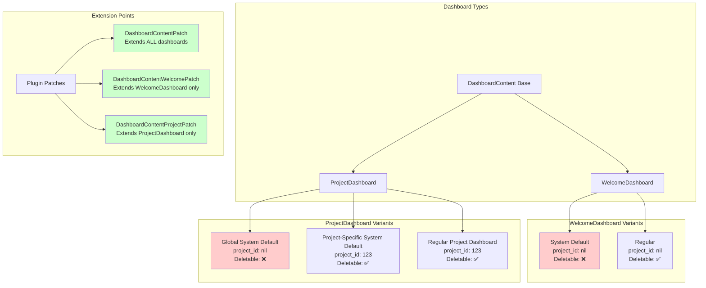

# Dashboard Development Guide

This guide helps developers create custom dashboard blocks for the Redmine dashboard system provided by the `additionals` plugin.

## Overview

**Most developers will create custom dashboard blocks, not new dashboard types.** This guide focuses on:

1. Creating custom dashboard blocks
2. Adding block settings
3. Implementing async blocks for better performance
4. View templates and helpers

## Architecture Overview



## Developing Dashboard Blocks

### Step 1: Simple Block Without Settings

This is the minimal setup to add a custom block to dashboards.

#### 1.1 Register the Block

Create a patch file: `lib/my_plugin/patches/dashboard_content_patch.rb`

```ruby
module MyPlugin
  module Patches
    module DashboardContentPatch
      extend ActiveSupport::Concern

      included do
        prepend InstanceOverwriteMethods
      end

      module InstanceOverwriteMethods
        def block_definitions
          blocks = super  # ← IMPORTANT: Get existing blocks

          blocks['my_simple_block'] = {
            label: l(:label_my_simple_block),
            permission: :view_issues,
            no_settings: true,
            partial: 'dashboards/blocks/my_simple_block'
          }

          blocks
        end
      end
    end
  end
end
```

#### 1.2 Activate the Patch

In your `init.rb`:

```ruby
Rails.application.config.after_initialize do
  DashboardContent.include MyPlugin::Patches::DashboardContentPatch
end
```

#### 1.3 Create the View

Create file: `app/views/dashboards/blocks/_my_simple_block.html.erb`

```erb
<h3><%= l(:label_my_simple_block) %></h3>
<div class="box">
  <p>This is my simple dashboard block!</p>
  <ul>
    <% Issue.open.limit(5).each do |issue| %>
      <li><%= link_to issue.subject, issue_path(issue) %></li>
    <% end %>
  </ul>
</div>
```

**Done!** Your block now appears in the dashboard block selector.

### Step 2: Block With Settings

Settings allow users to customize block behavior.

#### 2.1 Register Block With Settings

```ruby
blocks['my_configurable_block'] = {
  label: l(:label_my_block),
  permission: :view_issues,
  partial: 'dashboards/blocks/my_configurable_block',
  settings_partial: 'dashboards/blocks/my_configurable_block_settings'
}
```

#### 2.2 Create Settings View

Create file: `app/views/dashboards/blocks/_my_configurable_block_settings.html.erb`

```erb
<div class="box tabular settings">
  <p>
    <%= label_tag "settings_#{block}_title", l(:field_title) %>
    <%= text_field_tag "settings[#{block}][title]",
                       settings[:title],
                       size: 30,
                       placeholder: l(:label_my_block) %>
  </p>

  <p>
    <%= label_tag "settings_#{block}_max_entries", l(:label_max_entries) %>
    <%= number_field_tag "settings[#{block}][max_entries]",
                         settings[:max_entries].presence || 10,
                         min: 1,
                         max: 100,
                         required: true %>
  </p>

  <p>
    <%= check_box_tag "settings[#{block}][show_closed]",
                      1,
                      RedminePluginKit.true?(settings[:show_closed]) %>
    <%= label_tag "settings_#{block}_show_closed", l(:label_show_closed) %>
  </p>
</div>
```

#### 2.3 Use Settings in Block View

Create file: `app/views/dashboards/blocks/_my_configurable_block.html.erb`

```erb
<h3><%= settings[:title].presence || l(:label_my_block) %></h3>

<div class="box">
  <% max_entries = settings[:max_entries].presence || 10 %>
  <% show_closed = RedminePluginKit.true?(settings[:show_closed]) %>

  <% issues = Issue.visible %>
  <% issues = issues.open unless show_closed %>
  <% issues = issues.limit(max_entries.to_i) %>

  <% if issues.any? %>
    <ul>
      <% issues.each do |issue| %>
        <li>
          <%= link_to "##{issue.id}", issue_path(issue) %>:
          <%= issue.subject %>
        </li>
      <% end %>
    </ul>
  <% else %>
    <p class="nodata"><%= l(:label_no_data) %></p>
  <% end %>
</div>
```

### Step 3: Async Blocks (Performance Optimization)

Async blocks load content via AJAX after the page renders, improving initial page load time.

#### 3.1 Register Async Block

```ruby
blocks['my_async_block'] = {
  label: l(:label_my_async_block),
  permission: :view_issues,
  async: {
    partial: 'dashboards/blocks/my_async_block',
    cache_expires_in: 600  # Cache for 10 minutes
  },
  settings_partial: 'dashboards/blocks/my_async_block_settings'
}
```

#### 3.2 Create Async View With Cache Helper

Create file: `app/views/dashboards/blocks/_my_async_block.html.erb`

```erb
<% # Wrap content in dashboard_async_cache for proper caching %>
<% dashboard_async_cache dashboard, block, async, settings do %>

  <h3><%= settings[:title].presence || l(:label_my_async_block) %></h3>

  <div class="box">
    <% # This code runs asynchronously after page load %>
    <% issues = Issue.visible.open.limit(10) %>

    <% if issues.any? %>
      <table class="list">
        <thead>
          <tr>
            <th><%= l(:field_id) %></th>
            <th><%= l(:field_subject) %></th>
            <th><%= l(:field_status) %></th>
          </tr>
        </thead>
        <tbody>
          <% issues.each do |issue| %>
            <tr>
              <td><%= link_to "##{issue.id}", issue_path(issue) %></td>
              <td><%= issue.subject %></td>
              <td><%= issue.status.name %></td>
            </tr>
          <% end %>
        </tbody>
      </table>
    <% else %>
      <p class="nodata"><%= l(:label_no_data) %></p>
    <% end %>
  </div>

<% end %>
```

**Important:** Use `dashboard_async_cache` helper to wrap async block content. This helper:

- Manages AJAX loading
- Handles caching based on `cache_expires_in`
- Provides loading indicators

#### 3.3 Advanced Async Configuration

```ruby
blocks['my_advanced_async_block'] = {
  label: l(:label_my_block),
  permission: :view_issues,
  async: {
    partial: 'dashboards/blocks/my_block',
    cache_expires_in: 1800,  # 30 minutes
    unique_params: [
      Issue.maximum(:updated_on),        # Invalidate when issues change
      IssueStatus.maximum(:updated_on)   # Invalidate when statuses change
    ],
    required_settings: [:project_id, :tracker_id],  # Block won't load without these
    skip_user_id: false  # Include user_id in cache key (default)
  }
}
```

### Step 4: Real-World Example With Text Editor

This example shows a text block with Wiki formatting (from `additionals` plugin).

#### 4.1 Block Definition

```ruby
blocks['text_async'] = {
  label: l(:label_text_sync),
  async: {
    partial: 'dashboards/blocks/text_async',
    cache_expires_in: 600,
    unique_params: [Setting.text_formatting],  # Invalidate if formatting changes
    required_settings: [:text]  # Require text content
  },
  settings_partial: 'dashboards/blocks/text_async_settings'
}
```

#### 4.2 View Template

`app/views/dashboards/blocks/_text_async.html.erb`

```erb
<% dashboard_async_cache dashboard, block, async, settings do %>

  <% if settings[:title].present? %>
    <h3><%= settings[:title] %></h3>
  <% end %>

  <div class="wiki">
    <%= textilizable settings[:text] %>
  </div>

<% end %>
```

#### 4.3 Settings Template

`app/views/dashboards/blocks/_text_async_settings.html.erb`

```erb
<div class="box">
  <div class="settings">
    <p>
      <%= label_tag "settings_#{block}_title", l(:field_title) %>
      <%= text_field_tag "settings[#{block}][title]",
                         settings[:title] || l(:label_text_sync),
                         size: 50 %>
    </p>
    <p>
      <%= label_tag "settings_#{block}_text", l(:field_text) %>
      <%= text_area_tag "settings[#{block}][text]",
                        settings[:text],
                        rows: 15,
                        class: 'wiki-edit',
                        required: true %>
      <%= wikitoolbar_for "settings_#{block}_text" %>
    </p>
  </div>
</div>
```

**Note:** The `wikitoolbar_for` helper adds the Redmine wiki toolbar for formatting.

### Step 5: Complex Example From additional_tags

This example shows a feature-rich block with tables, filters, and settings.

#### 5.1 Block Definition

From `additional_tags/lib/additional_tags/patches/dashboard_content_patch.rb`:

```ruby
blocks['issue_tags'] = {
  label: l(:field_issue_tags),
  permission: :view_issue_tags,
  if: proc { AdditionalTags.setting?(:active_issue_tags) },
  async: { partial: 'dashboards/blocks/issue_tags' },
  settings_partial: 'dashboards/blocks/issue_tags_settings'
}
```

#### 5.2 View Template (Simplified)

From `additional_tags/app/views/dashboards/blocks/_issue_tags.html.slim`:

```erb
<h3>
  <%= svg_icon_tag 'tags', label: block_definition[:label] %>
</h3>

<% open_issues_only = RedminePluginKit.true?(settings[:open_issues_only]) %>
<% tags = Issue.available_tags(project: @project, open_issues_only: open_issues_only) %>

<% if RedminePluginKit.true?(settings[:with_table_of_values]) %>
  <% if tags.present? %>
    <table class="list tags">
      <thead>
        <tr>
          <th><%= l(:field_name) %></th>
          <% unless open_issues_only %>
            <th><%= l(:label_open_issues_plural) %></th>
            <th><%= l(:label_closed_issues_plural) %></th>
          <% end %>
          <th><%= l(:label_total) %></th>
        </tr>
      </thead>
      <tbody>
        <% tags.each do |tag| %>
          <tr>
            <td class="name">
              <%= link_to tag.name, issues_path(tag: tag.name) %>
            </td>
            <% unless open_issues_only %>
              <td class="value"><%= tag.open_count %></td>
              <td class="value"><%= tag.closed_count %></td>
            <% end %>
            <td class="value"><%= tag.total_count %></td>
          </tr>
        <% end %>
      </tbody>
    </table>
  <% else %>
    <p class="nodata"><%= l(:label_no_data) %></p>
  <% end %>
<% end %>
```

#### 5.3 Settings Template

From `additional_tags/app/views/dashboards/blocks/_issue_tags_settings.html.slim`:

```erb
<div class="box tabular settings">
  <p>
    <%= check_box_tag "settings[#{block}][with_table_of_values]",
                      1,
                      RedminePluginKit.true?(settings[:with_table_of_values]) %>
    <%= label_tag "settings_#{block}_with_table_of_values",
                  l(:label_with_table_of_values) %>
  </p>

  <p>
    <%= check_box_tag "settings[#{block}][open_issues_only]",
                      1,
                      RedminePluginKit.true?(settings[:open_issues_only]) %>
    <%= label_tag "settings_#{block}_open_issues_only",
                  l(:label_open_issues_only) %>
  </p>

  <p>
    <%= check_box_tag "settings[#{block}][use_colors]",
                      1,
                      RedminePluginKit.true?(settings[:use_colors]) %>
    <%= label_tag "settings_#{block}_use_colors",
                  l(:label_use_colors) %>
  </p>
</div>
```

### Available Variables in Block Views

When rendering a block, these variables are available:

| Variable | Type | Description |
|----------|------|-------------|
| `@dashboard` | Dashboard | Current dashboard instance |
| `@project` | Project | Current project (nil for WelcomeDashboard) |
| `block` | String | Block name (e.g., 'my_block') |
| `settings` | Hash | User-configured settings for this block |
| `block_definition` | Hash | Block definition hash (label, permission, etc.) |
| `async` | Hash | Async configuration (if async block) |

### Helper Methods for Settings Forms

The `additionals` plugin provides helper methods for consistent settings forms:

```ruby
# Text field
additionals_settings_textfield :title,
                               label: :field_title,
                               value: settings[:title],
                               tag_name: "settings[#{block}][title]"

# Number field
additionals_settings_numberfield :max_entries,
                                 value: settings[:max_entries] || 10,
                                 tag_name: "settings[#{block}][max_entries]",
                                 min: 1,
                                 max: 100,
                                 required: true

# Checkbox
additionals_settings_checkbox :auto_refresh,
                              label: :label_enable_auto_refresh,
                              active_value: settings[:auto_refresh],
                              tag_name: "settings[#{block}][auto_refresh]"

# Select
additionals_settings_select :query_id,
                            options_for_query_select(IssueQuery, @project),
                            label: :label_query,
                            tag_name: "settings[#{block}][query_id]",
                            required: true
```

These helpers automatically:

- Generate correct `name` attributes for form fields
- Handle labeling consistently
- Support required field validation
- Work with the dashboard settings system

## Block Definition Options Reference

Each block is defined by a hash with these options:

### Basic Options

| Option | Type | Description | Example |
|--------|------|-------------|---------|
| `label` | String/Symbol | Display name (shown in block selector) | `l(:label_my_block)` |
| `permission` | Symbol/Array | Required permission(s) | `:view_issues` or `[:view_issues, :edit_issues]` |
| `if` | Proc | Conditional visibility | `proc { User.current.admin? }` |
| `partial` | String | View template for synchronous rendering | `'dashboards/blocks/my_block'` |
| `no_settings` | Boolean | Block has no user settings | `true` |

### Advanced Options

| Option | Type | Description |
|--------|------|-------------|
| `async` | Hash | Asynchronous loading configuration (see below) |
| `settings_partial` | String | Custom settings form partial |
| `with_settings_if` | Proc | Conditional settings availability |
| `max_occurs` | Integer | Maximum times block can be added (`DashboardContent::MAX_MULTIPLE_OCCURS`) |
| `query_block` | Hash | Query-based block configuration (for IssueQuery, etc.) |
| `matrix` | Hash | Matrix chart configuration |
| `chart` | Hash | Chart configuration |

### Async Loading Configuration

Async blocks load content via AJAX (improves page load performance):

```ruby
async: {
  partial: 'dashboards/blocks/my_block',         # Required: View template
  cache_expires_in: 3600,                        # Optional: Cache TTL in seconds
  unique_params: [Issue.maximum(:updated_on)],   # Optional: Cache key params
  required_settings: [:status_id, :tracker_id],  # Optional: Required settings
  skip_user_id: true                             # Optional: Exclude user_id from cache key
}
```

### Query Block Configuration

For blocks displaying query results (issues, time entries, etc.):

```ruby
query_block: {
  label: l(:label_issues),
  list_partial: 'issues/list',         # View template for list
  class: IssueQuery,                   # Query class
  link_helper: '_project_issues_path', # URL helper method
  entities_var: :issues,               # Variable name for results
  with_project: true,                  # Include project in query
  count_method: 'issue_count',         # Optional: Custom count method
  entries_method: 'issues'             # Optional: Custom entries method
}
```

## Dashboard Types

### WelcomeDashboard (`DashboardContentWelcome`)

**Purpose:** Displays content on the Redmine welcome/home page (accessible without project context).

**Characteristics:**

- Always global: `project_id` is always `nil` (enforced in `dashboard_type_check`)
- Can be set as System Default
- Only **one** System Default WelcomeDashboard allowed globally

**Available Blocks (from additionals):**

- `welcome` - Welcome text from settings
- `activity` - Activity stream
- `legacy_left` - Legacy left column content
- `legacy_right` - Legacy right column content

**Default Layout:**

```ruby
{
  'left' => ['welcome', 'legacy_left'],
  'right' => ['legacy_right']
}
```

**Extending with custom blocks:** Use `DashboardContentWelcomePatch` or `DashboardContentPatch`.

### ProjectDashboard (`DashboardContentProject`)

**Purpose:** Displays content on project overview pages.

**Characteristics:**

- Can be project-specific OR global
- Can be set as System Default (with different scopes)
- Multiple System Defaults possible (one per project + one global fallback)

**Available Blocks (from additionals):**

- `projectinformation` - Project description and custom fields
- `projectissues` - Issues summary
- `projecttimeentries` - Time tracking summary
- `projectmembers` - Project members list
- `projectsubprojects` - Subprojects list
- `legacy_left` - Legacy left column content
- `legacy_right` - Legacy right column content

**Default Layout:**

```ruby
{
  'left' => ['projectinformation', 'projectissues', 'projecttimeentries'],
  'right' => ['projectmembers', 'projectsubprojects']
}
```

**Extending with custom blocks:** Use `DashboardContentProjectPatch` or `DashboardContentPatch`.

## System Default Concept

### What is a System Default?

A **System Default** dashboard is automatically used as the default dashboard for users when:

1. No recently used dashboard is available
2. No user-specific dashboard exists

### System Default Rules

**WelcomeDashboard:**

- Only **one** System Default allowed globally
- Must have `project_id = nil` (always global)
- `system_default = true`

**ProjectDashboard:**

- Only **one** global System Default allowed (`project_id = nil`)
- **Multiple** project-specific System Defaults allowed (one per project)
- `system_default = true`

### ProjectDashboard System Default Variants

#### Variant 1: Global System Default (Fallback)

```ruby
{
  dashboard_type: 'ProjectDashboard',
  system_default: true,
  project_id: nil  # ← No project assigned
}
```

**Usage:** Used as fallback for ALL projects that don't have a project-specific System Default.

#### Variant 2: Project-Specific System Default

```ruby
{
  dashboard_type: 'ProjectDashboard',
  system_default: true,
  project_id: 123  # ← Assigned to specific project
}
```

**Usage:** Used as default for **this specific project only**.

#### Variant 3: Regular Project Dashboard

```ruby
{
  dashboard_type: 'ProjectDashboard',
  system_default: false,
  project_id: 123  # ← Assigned to specific project
}
```

**Usage:** Custom dashboard for a project (not a default).

### System Default Priority

When determining which dashboard to use for a project:

1. **Recently used dashboard** (user preference)
2. **Project-specific System Default** (`system_default = true`, `project_id = <project_id>`)
3. **Global System Default** (`system_default = true`, `project_id = nil`)
4. **User's own dashboard** (created by current user)

See `Dashboard.default` method (line 79-107) for implementation.

## Deletion Rules (`deletable?`)

### Logic (line 273-280)

```ruby
def deletable?(user = User.current)
  return false unless editable? user

  return !system_default_was if dashboard_type != DashboardContentProject::TYPE_NAME

  # project dashboards needs special care
  project.present? || !system_default_was
end
```

### Deletion Rules by Dashboard Type

**WelcomeDashboard:**

- ✅ **Deletable:** If NOT System Default (`system_default = false`)
- ❌ **NOT Deletable:** If System Default (`system_default = true`)

**ProjectDashboard:**

- ✅ **Deletable:** If `project.present?` (project-specific dashboard)
- ✅ **Deletable:** If NOT System Default (`system_default = false`)
- ❌ **NOT Deletable:** If System Default AND `project_id = nil` (global fallback)

### Why Global System Defaults Cannot Be Deleted

Global System Defaults serve as fallback templates:

- **WelcomeDashboard System Default:** Required as fallback for welcome page
- **ProjectDashboard Global System Default:** Required as fallback for projects without specific default

Deleting them would break the default dashboard functionality.

### Protection Mechanism

Two callbacks prevent accidental deletion:

```ruby
before_destroy :check_locked        # Prevents deletion of locked dashboards
before_destroy :check_destroy_system_default  # Prevents deletion of non-deletable dashboards
```

If a non-deletable dashboard deletion is attempted:

```ruby
def check_destroy_system_default
  raise 'It is not allowed to delete dashboard, which is system default' unless deletable?
end
```

## Database Schema

### Key Attributes

```ruby
# Dashboard model
belongs_to :project  # Optional (can be nil for global dashboards)
belongs_to :author, class_name: 'User'

# Important fields
dashboard_type    # 'WelcomeDashboard' or 'ProjectDashboard'
system_default    # Boolean - is this a System Default?
project_id        # Integer or nil - project assignment
visibility        # PRIVATE (0), ROLES (1), PUBLIC (2)
locked           # Boolean - prevents editing
name             # String - dashboard name
options          # Serialized hash - layout, settings, etc.
```

### Validations

**System Default Validations:**

1. **Cannot change from System Default to non-System Default** (line 374-381):

   ```ruby
   def validate_system_default
     return if new_record? ||
               system_default_was == system_default ||
               system_default? ||
               project_id.present?

     raise SystemDefaultChangeException
   end
   ```

2. **ProjectDashboard System Default cannot change project assignment** (line 383-387):

   ```ruby
   def validate_project_system_default
     return if project_id_can_change?

     raise ProjectSystemDefaultChangeException if project_id.present?
   end
   ```

3. **System Default must be PUBLIC** (line 425-427):

   ```ruby
   def validate_visibility
     errors.add :visibility, :must_be_for_everyone if system_default? && visibility != VISIBILITY_PUBLIC
   end
   ```

## System Default Updates

When a dashboard is marked as System Default, all other System Defaults of the same type are automatically disabled:

```ruby
def update_system_defaults
  return unless system_default? && User.current.allowed_to?(:set_system_dashboards, project, global: true)

  scope = self.class
              .where(dashboard_type:)
              .where.not(id:)

  scope = scope.where project: project if dashboard_type == DashboardContentProject::TYPE_NAME

  scope.update_all system_default: false
end
```

**For ProjectDashboard:**

- Setting `system_default = true` with `project_id = 123` disables other System Defaults for **that project**
- Setting `system_default = true` with `project_id = nil` disables other global System Defaults

**For WelcomeDashboard:**

- Setting `system_default = true` disables all other WelcomeDashboard System Defaults

## Automatic Project Assignment

**WelcomeDashboard** enforces `project_id = nil`:

```ruby
def dashboard_type_check
  self.project_id = nil if dashboard_type == DashboardContentWelcome::TYPE_NAME
end
```

Even if you try to assign a project to a WelcomeDashboard, it will be removed automatically.

## Visibility Levels

Dashboards support three visibility levels:

```ruby
VISIBILITY_PRIVATE = 0  # Only visible to author
VISIBILITY_ROLES   = 1  # Visible to specific roles
VISIBILITY_PUBLIC  = 2  # Visible to everyone
```

**System Default Requirement:**

- System Defaults **must** have `VISIBILITY_PUBLIC`
- This ensures all users can see and use the default dashboard

## Example Scenarios

### Scenario 1: Global ProjectDashboard System Default

```ruby
Dashboard.create!(
  name: 'Default Project Overview',
  dashboard_type: 'ProjectDashboard',
  system_default: true,
  project_id: nil,  # ← Global fallback
  visibility: Dashboard::VISIBILITY_PUBLIC,
  author: User.current
)
```

**Usage:** This dashboard is used for ALL projects that don't have a project-specific System Default.

**Deletable?** ❌ NO - Cannot delete global System Default

### Scenario 2: Project-Specific System Default

```ruby
project = Project.find(123)

Dashboard.create!(
  name: 'Project 123 Default',
  dashboard_type: 'ProjectDashboard',
  system_default: true,
  project_id: 123,  # ← Specific project
  visibility: Dashboard::VISIBILITY_PUBLIC,
  author: User.current
)
```

**Usage:** This dashboard is used as default for project 123 only.

**Deletable?** ✅ YES - Project-specific dashboards are deletable (even if System Default)

### Scenario 3: Custom Project Dashboard

```ruby
Dashboard.create!(
  name: 'My Custom Dashboard',
  dashboard_type: 'ProjectDashboard',
  system_default: false,  # ← Not a default
  project_id: 123,
  visibility: Dashboard::VISIBILITY_PRIVATE,
  author: User.current
)
```

**Usage:** Personal dashboard for project 123 (not used as default).

**Deletable?** ✅ YES - Regular dashboards are always deletable

### Scenario 4: WelcomeDashboard System Default

```ruby
Dashboard.create!(
  name: 'Welcome Page Default',
  dashboard_type: 'WelcomeDashboard',
  system_default: true,
  project_id: nil,  # ← Always nil (enforced)
  visibility: Dashboard::VISIBILITY_PUBLIC,
  author: User.current
)
```

**Usage:** Used as default welcome page for all users.

**Deletable?** ❌ NO - Cannot delete WelcomeDashboard System Default

## Key Methods Reference

### `Dashboard.system_default(dashboard_type)`

Returns the System Default ID for a dashboard type:

```ruby
Dashboard.system_default('ProjectDashboard')  # → ID of global System Default or nil
Dashboard.system_default('WelcomeDashboard')  # → ID of System Default or nil
```

### `Dashboard.default(dashboard_type, project, user, recently_id)`

Returns the appropriate dashboard for a user/project combination (considering priority order).

### `dashboard.deletable?(user)`

Returns `true` if dashboard can be deleted by user.

### `dashboard.project_id_can_change?`

Returns `true` if `project_id` can be modified:

- Always `true` for new records
- Always `true` for non-ProjectDashboard types
- `false` for ProjectDashboard System Defaults with `project_id = nil` (cannot assign project to global default)
- `true` if previous `project_id` was present (can change between projects)

## Common Pitfalls

### 1. Cannot Delete Global System Default

**Error:**

```ruby
dashboard = Dashboard.find_by(system_default: true, project_id: nil, dashboard_type: 'ProjectDashboard')
dashboard.destroy
# → RuntimeError: It is not allowed to delete dashboard, which is system default
```

**Solution:** Only delete project-specific dashboards, never global System Defaults.

### 2. Cannot Change Project of Global System Default

**Error:**

```ruby
dashboard = Dashboard.find_by(system_default: true, project_id: nil, dashboard_type: 'ProjectDashboard')
dashboard.project_id = 123
dashboard.save
# → ProjectSystemDefaultChangeException
```

**Solution:** Global System Defaults must remain global (`project_id = nil`).

### 3. WelcomeDashboard Always Global

**Error:**

```ruby
Dashboard.create!(
  dashboard_type: 'WelcomeDashboard',
  project_id: 123  # ← Will be set to nil automatically
)
```

**Result:** `project_id` is automatically set to `nil` in `dashboard_type_check` callback.

### 4. Forgetting to Call `super` in Patch

**Error:**

```ruby
def block_definitions
  blocks = {}  # ← Wrong! Ignores parent blocks
  blocks['my_block'] = { ... }
  blocks
end
```

**Solution:** Always call `super` to get existing blocks:

```ruby
def block_definitions
  blocks = super  # ← Correct!
  blocks['my_block'] = { ... }
  blocks
end
```

## Testing Considerations

### Fixture Setup

When creating test fixtures, ensure:

1. **Global System Defaults exist** for both types
2. **Project-specific System Defaults** are properly assigned
3. **Regular dashboards** have `system_default = false`

### Deleting Projects in Tests

When deleting projects that have dashboards:

- Project-specific dashboards (with `project_id`) are deleted via `dependent: :destroy`
- Global System Defaults (`project_id = nil`) must NOT be affected
- Ensure test fixtures don't accidentally link global defaults to projects

### Example Test Setup

```ruby
# Global ProjectDashboard System Default (safe to keep)
Dashboard.create!(
  name: 'Global Default',
  dashboard_type: 'ProjectDashboard',
  system_default: true,
  project_id: nil,  # ← Global, won't be deleted
  visibility: Dashboard::VISIBILITY_PUBLIC
)

# Project-specific dashboard (will be deleted with project)
Dashboard.create!(
  name: 'Project Dashboard',
  dashboard_type: 'ProjectDashboard',
  system_default: false,
  project_id: project.id,  # ← Will be deleted when project is destroyed
  visibility: Dashboard::VISIBILITY_PUBLIC
)

project.destroy  # ← Only project-specific dashboard is deleted
```

## References

- `app/models/dashboard.rb` - Main Dashboard model
- `app/models/dashboard_content.rb` - Base class for dashboard content
- `app/models/dashboard_content_welcome.rb` - WelcomeDashboard implementation
- `app/models/dashboard_content_project.rb` - ProjectDashboard implementation
- [additional_tags plugin](https://github.com/alphanodes/additional_tags) - Public example of dashboard extension
