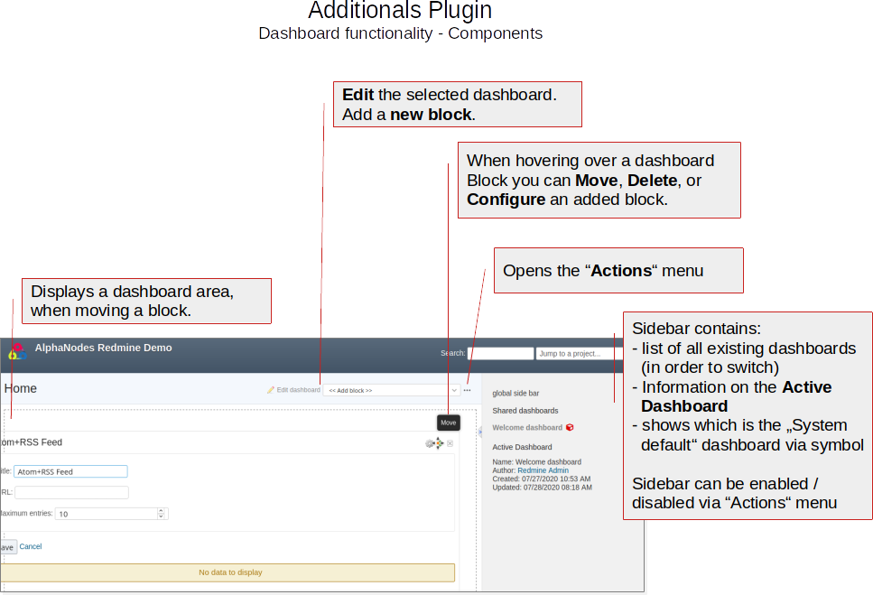
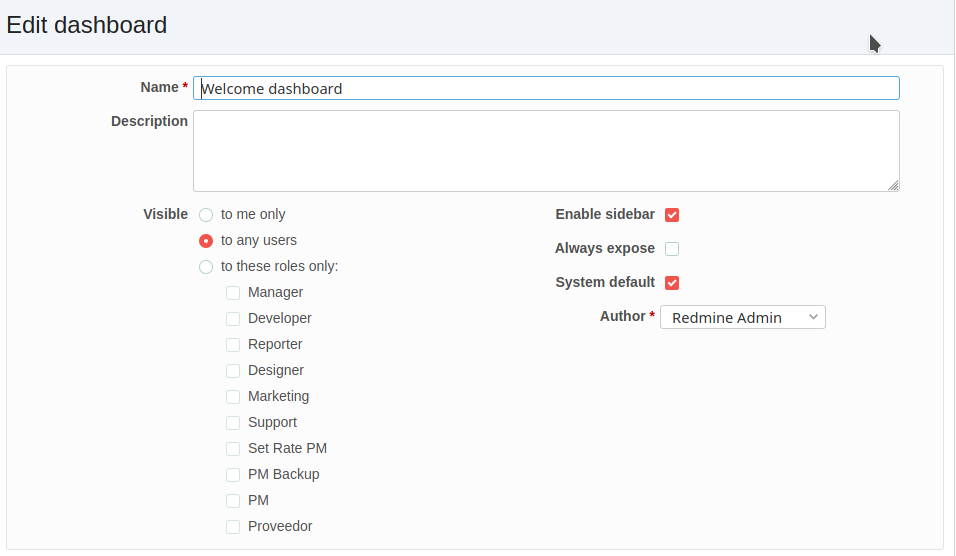
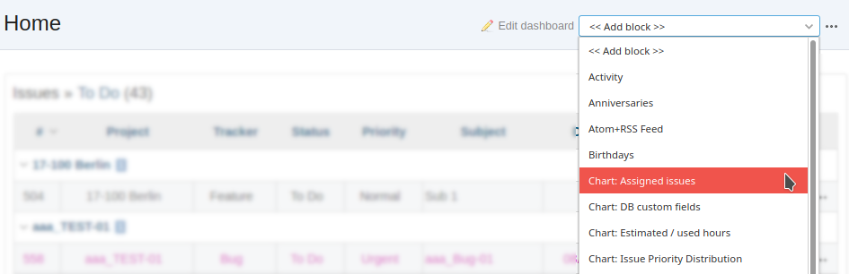
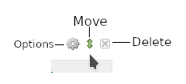
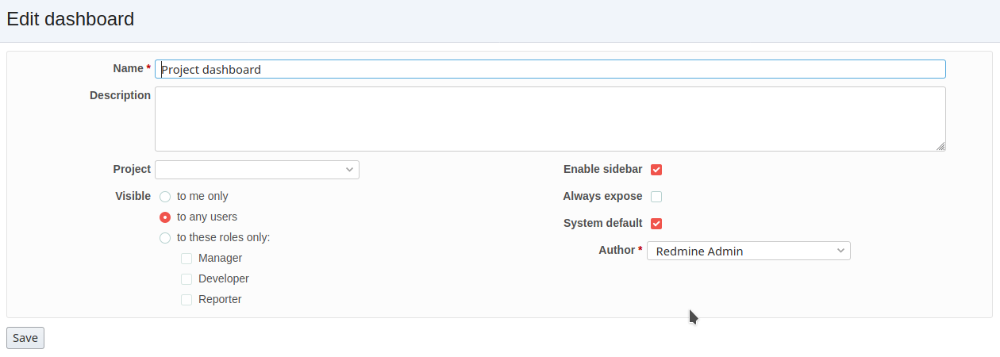
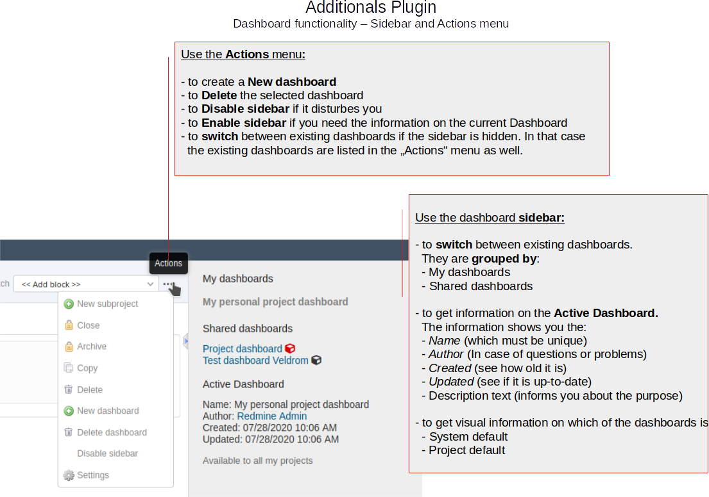

Dashboards
==========

The additionals plugin version 3.0.0 comes with new dashboard support (Drag & Drop). The new *Dashboard* feature of the additionals plugin provides customizable areas to display and organize content from Redmine that support the functionality.

Specifically, you can customize the traditional Redmine main page, as well as the project overview pages according to your needs using the available dashboard blocks. The goal is to give the viewer an immediate overview of the issues or to display the metrics that are important to you.

The dashboard configuration takes place directly in Redmine:

*  On the "Home" page
*  On the Project overview page
*  If other plugins are installed and support the dashboard functionality there might be also other areas. For example:

    * Redmine HRM Plugin: HRM overview page

   Figure shows the main areas of the dashboard function

**Dashboard examples**

With the *Dashboard* of the *additionals* plugin for Redmine you can for example:

*  design the Redmine main page or project overview page so that the information relevant to you is displayed there at a glance.
*  create your own (private) dashboards independent of the predefined default dashboard and switch between them as needed.
*  create dashboards for other users or specific roles. As well as share your own dashboards publicly and make them available to your team.

.. note::
  When using the dashboard function make sure you have already configured the *additionals permissions* the way you need them.

**Dashboard permissions**

If you want to use the dashboard functionality you need to configure the permissions for the respective user roles, which are:

*  Save dashboards
*  Set system dashboards
*  Share dashboards

Dashboard: Home
---------------

When accessing Redmine you probably get redirected to the "Home" page of the system. Users with appropriate permissions can modify the existing dashboard or add new dashboards by using the respective action links in the head section of the content area.

.. figure::  images/dashboard-home.png
   :align:   center

   Figure shows the Redmine *Home* page and where to find the dashboard actions

What you can do here is:

*  use the "Edit dashboard" link for modifications
*  add a "New dashboard"
*  Enable sidebar or Disable sidebar
*  Switch to other existing dashboards
*  Add a dashboard block
*  Move, Delete or configure added dashboard blocks

Edit Dashboard
++++++++++++++

Users with appropriate permission can edit an existing dashboard by clicking the "Edit dashboard" link to open the edit window.

There you can make changes to the following fields:

Name
  The standard dashboard after the plugin installation is called "Welcome Dashboard". Modify it according to your needs.

Description
  The dashboard description will be displayed in the sidebar next to the dashboard as soon as a dashboard has been been selected to be active.

Visible
  There are various visibility settings for a dashboard like "to me only", "to any users", "to these roles only". If you want to mak a dashboard publicly available to all other users you have to choose the option "to any users". For a specific role choose the respective role instead.

Enable sidebar
  The dashboard sidebar contains some useful information for the user. Since it is sometimes disturbing, it is hidden. To prevent this you can select this option.

System default
  If you want to make your project dashboard system default, activate this option. So every user will have to work with it for the selected project.

Always expose
  If you want to make the system default dashboard name visible to the users in the head section of the dashboard page, you can activate this option. Then also the dashboard information in the sidebar is displayed.

Author
  You can change the dashboard author in case it is necessary. This is sometimes necessary, if you create a dasboard for someone else but want this person to be able to edit it afterwards. Or if a user will no longer be active in your Redmine system. *Important:* Only the author of a dashboard is able to edit or remove it. If the author is no longer an active user in your system, only a user with administration rights is allowed to modify the dashboard.

.. hint::
  In general, dashboards can only be edited by a single author. Not by a group. Users with administrator rights can change the author in an emergency.

.. note::
  The selection of the Author depends on the set permission for a role in the administration area. Only those user roles with the minimum permission **Save dashboards** or users with administration rights are selectable.

New Dashboard
+++++++++++++

Users with appropriate permission can add a new dashboard by clicking the "New dashboard" link in the "actions menu" to open the "New dashboard" window to fill out the following fields.

Name
  Assign a meaningful and unique name. The dashboard name will be displayed in the sidebar for later selection. If the sidebar has been disabled, you can select the dashboard from the "Actions" menu. The name must be unique.

Description
  The dashboard description will be displayed in the sidebar next to the dashboard as soon as a dashboard has been been selected to be active.

Visible
  There are various visibility settings for a dashboard like "to me only", "to any users", "to these roles only". If you want to mak a dashboard publicly available to all other users you have to choose the option "to any users". For a specific role choose the respective role instead.

Enable sidebar
  The dashboard sidebar contains some useful information for the user. Since it is sometimes disturbing, it is hidden. To prevent this you can choose this option.

System default
  If you want to make your project dashboard system default, activate this option. So every user will have to work with it for the selected project.

Always expose
  If you want to make the system default dashboard name visible to the users in the head section of the dashboard page, you can activate this option. Then also the dashboard information in the sidebar is displayed.

Add Dashboard blocks
++++++++++++++++++++

You can fill existing dashboards with content by using the select box "Add block".

The blocks that are available here depend on the functions you are using and the plugins you have on your system. They need to support the dashboard functionality of the additionals plugin. Which is not hard to do so, because it's easy to implement for plugin developers.

1. In order to add a new dashboard block, just select the respective option from the selection box. The block will be added right away.

.. note::
  The selection displays only blocks, that are allowed to be displayed on the Redmine Home page. Others are not available for selection. Currently the following plugins have additionals dashboard support implemented: DB, Passwords, Reporting, HRM, Automation, additionals

2. You probably need to position the block. In that case hover your mouse over the right block corner and grap the "Move" icon. Now position it somewhere else. If you need to remove it again use the "Delete" icon.

.. note::
  Be careful with the deletion option. If you delete a block it will be gone right away.

3. Some blocks can be configured. In that case hover your mouse over the right block corner and click the "Options" icon. The configuration option appears and you can make your changes. Done.

.. figure::  images/dashboard-options.png
   :align:   center

.. note::
  Not every block is configurable and the block configuration may differ depending on the selection you have made. Some blocks may allow to change the column settings and other only the maximum entries, for example.

Dashboard: Project overview
---------------------------

The project overview page is also supporting the new Dashboard function. Users with appropriate permissions can modify the existing dashboard or add new dashboards by using the respective action links in the head section of the content area.

.. figure::  images/dashboard-projectoverview.png
   :align:   center

   Figure shows the project overview page and where to find the dashboard actions

What you can do here is:

*  use the "Edit dashboard" link for modifications
*  add a "New dashboard"
*  Enable sidebar or Disable sidebar
*  Switch to other existing dashboards
*  Add a dashboard block
*  Move, Delete or configure added dashboard blocks

Edit project dashboard
++++++++++++++++++++++

Users with appropriate permission can edit an existing dashboard by clicking the "Edit dashboard" link to open the edit window. What fields are displayed also depends on the permission the role your user has.

There you can make changes to the following fields:

Name
  The standard dashboard after the plugin installation is called "Project Dashboard". Modify it according to your needs. The name must be unique.

Description
  The dashboard description will be displayed in the sidebar next to the dashboard as soon as a dashboard has been been selected to be active.

Project
  Here you can select the project this dashboard should be assigned to in case you decide to make it available to special project, only. It is for all projects, if you do not select a project.

Visible
  There are various visibility settings for a dashboard like "to me only", "to any users", "to these roles only". If you want to mak a dashboard publicly available to all other users you have to choose the option "to any users". For a specific role choose the respective role instead.

Enable sidebar
  The dashboard sidebar contains some useful information for the user. Since it is sometimes disturbing, it is hidden. To prevent this you can select this option.

System default
  If you want to make your project dashboard system default, activate this option. So every user will have to work with it for the selected project.

Always expose
  If you want to make the system default dashboard name visible to the users in the head section of the dashboard page, you can activate this option. Then also the dashboard information in the sidebar is displayed.

Author
  You can change the dashboard author in case it is necessary. This is sometimes necessary, if you create a dasboard for someone else but want this person to be able to edit it afterwards. Or if a user will no longer be active in your Redmine system. *Important:* Only the author of a dashboard is able to edit or remove it (required permissions assumed). If the author is no longer an active user in your system, only a user with administration rights is allowed to modify the dashboard.

.. hint::
  In general, dashboards can only be edited by a single author. Not by a group. Users with administrator rights can change the author in an emergency.

.. note::
  The selection of the Author depends on the set permission for a role in the administration area. Only those user roles with the minimum permission **Save dashboards** or users with administration rights are selectable.

.. note::
  Usually the system default "Project dashboard" looks like the standard project page of Redmine. It contains the same areas as "blocks". These can be repositioned or partially hidden. It is up to you if you want to change it. If not, just leave it the way they are.

New project dashboard
+++++++++++++++++++++

Users with appropriate permission can add a new project dashboard by clicking the "New dashboard" link in the "actions menu" to open the "New dashboard" window in order to fill out the following fields. What fields are displayed also depends on the permission the role your user has.

Name
  Assign a meaningful and unique name. The dashboard name will be displayed in the sidebar for later selection. If the sidebar has been disabled, you can still select the dashboard from the "Actions" menu. It will then be listed there.

Description
  The dashboard description will be displayed in the sidebar next to the dashboard as soon as a dashboard has been been selected to be active.

Project
  Select a project for which the new dashboard is planned. If no project is selected here, it will be available to all projects.

Visible
  There are various visibility settings for a dashboard like "to me only", "to any users", "to these roles only". If you want to mak a dashboard publicly available to all other users you have to choose the option "to any users". For a specific role choose the respective role instead.

Enable sidebar
  The dashboard sidebar contains some useful information for the user. Since it is sometimes disturbing, it is hidden. To prevent this you can choose this option.

System default
  If you want to make your project dashboard system default, activate this option. So every user will have to work with it for the selected project.

Always expose
  If you want to make the system default dashboard name visible to the users in the head section of the dashboard page, you can activate this option. Then also the dashboard information in the sidebar is displayed.

Add project dashboard blocks
++++++++++++++++++++++++++++

You can fill existing project dashboards with content by using the select box "Add block".

The blocks that are available here depend on the functions you are using and the projects. They need to support the dashboard functionality of the additionals plugin. Which is not hard to do so, because it's easy to implement for plugin developers.

1. In order to add a new project dashboard block, just select the respective option from the selection box. The block will be added right away.

.. note::
  The selection displays only blocks, that are allowed to be displayed on the Redmine project area. Others are not available for selection. Currently the following plugins have additionals dashboard support implemented: DB, Passwords, Reporting, HRM, Automation, additionals

2. You probably need to position the block. In that case hover your mouse over the right block corner and grap the "Move" icon. Now position it somewhere else. If you need to remove it again use the "Delete" icon.

.. note::
  Be careful with the deletion option. If you delete a block it will be gone right away.

3. Some blocks can be configured. In that case hover your mouse over the right block corner and click the "Options" icon. The configuration option appears and you can make your changes. Done.

.. figure::  images/dashboard-options.png
   :align:   center

.. note::
  Not every block is configurable and the block configuration may differ depending on the selection you have made. Some blocks may allow to change the column settings and other only the maximum entries, for example.

General dashboard actions
-------------------------

Some actions on the dashboards are the same whether you are on a dashboard of the home page or the project overview page.

Switching dashboards
  You have two options to switch between existing dashboards. If the sidebar is activated for the dashboard you can select the respective dashboard from the sidebar section. They are grouped by *My dashboards* or *Shared dashboards*.

Enable or disable sidebar
  If the sidebar is hidden by default you can activate it via the *Actions* menu. Just select the menu option *Enable sidebar*. If the sidebar is displayed but you want to hide it select the menu option *Disable sidebar*.

View sidebar information
  The sidebar contains always the same information for the user like general globa infos, that are stored there or dashboard specific information regarding the *Active Dashboard* or other dashboards, which are available to you as user.

Some other general dashboard actions are the selection box in order to

Add blocks
  The content which can be added to the active dashboard depends on the functions you are using on your Redmine and the developer of the function. Those need to support the dashboard *Drag & Drop* functionality with their plugin. Regardless of this, the dashboard is always filled with content via the "Add block" selection.

Dashboard blocks
----------------

The following blocks are delivered as standard when using the additionals dashboard function.

General blocks for all areas (e.g. *Home* and *Project overview*) are:

Query: Issues
  You can configure the block content by selecting the *Issue Query* you want to display and choosing a number for *Maximum entries* to be displayed.
  Maximum number of such blocks per dashboard: **8**

Text
  You can add individual text passages to your dashboard and use the wiki editor for structuring this text. If you want to work with macros, that include large amount of information (e.g. issue lists), use the *Text (asynchronous)* block instead, because it is cached asyncronous for 30 seconds due to performance reasons.
  Maximum number of such blocks per dashboard: **8**

Text (asynchronous)
  This block is perfect if you want to implement macros into your text area. You can add individual text passages to your dashboard and use the wiki editor for structuring this text. Please note, that some macros are only usable in Wiki pages of a project, but not in issues or dashboard blocks. In that case no content will be displayed, but only the macro code.
  Maximum number of such blocks per dashboard: **8**

Latest news
  Add the latest news block to your dashboard to show your user's what is going on in your system. The block configuration allows you to edit the number of *Maximum entries*.
  Maximum number of such blocks per dashboard: **1**

Documents
  Add the *Documents* block to your dashboard to show your user's the latest documents, uploaded in Redmine. The block configuration allows you to edit the number of *Maximum entries*.
  Maximum number of such blocks per dashboard: **1**

Static spent time
  Add the *Spent time* block to your dashboard to show the spent time activities. The block configuration allows you to edit the number of *Days* displayed in the block.
  Maximum number of such blocks per dashboard: **1**

Atom+RSS Feed
  You can configure the block content by changing the *Title*, adding an *URL* and choosing a number for *Maximum entries* to be displayed.
  Maximum number of such blocks per dashboard: **8**

Special blocks for the welcome page *Home* are:

Standard content left / Standard content right
  There are plugin developers who do not support our dashboard function and may have implement own content on the Redmine start page (legacy_left and legacy_right). These are usually not displayed due to the lack of dashboard support. If you still want to see this, select one of the two blocks or both for displaying such content.

Activity
  You can configure the activity block content by choosing a number for *Maximum entries* to be displayed. And in case you are only interested in your own activities by activating the option *Only my activity*. Maximum number of such blocks per dashboard: **1**

Welcome
  If you have specified a welcome text in the Redmine system settings you can display this text in the dashboard as well, by choosing the *Welcome* block. Maximum number of such blocks per dashboard: **1**

Special blocks for *Project overview* are:

Standard content left / Standard content right
  There are plugin developers who do not support our dashboard function and may have implement own content on the Redmine project overview page (legacy_left and legacy_right). These are usually not displayed due to the lack of dashboard support. If you still want to see this, select one of the two blocks or both for displaying such content as well.

Project information
  Displays the standard project information of Redmine in a block. Containing the project information from the project settings like custom fields for projects, description, URL etc. The block is not configurable, but you can remove it if not needed or reposition it.

Subprojects
  Displays the standard subproject information of Redmine in a block, if you have configured them in the project settings. The block is not configurable, but you can remove it if not needed or reposition it.

Issue tracking
  Displays the standard issue tracking information of Redmine in a block. The block is not configurable, but you can remove it if not needed or reposition it.

Time tracking
  Displays the standard issue tracking information of Redmine in a block including the additionals adaption to the information displayed there. The block is not configurable, but you can remove it if not needed or reposition it.

Members
  Displays the standard member box of Redmine in a block including the additionals permission adaption to the information displayed there. The block is not configurable, but you can remove it if not needed or reposition it.

.. note::
  These are the basic blocks that come with the additionals plugin dashboard functionality. Other plugins, that also support the *Drag&Drop* dashboard function may deliver additional blocks for selection.

.. note::
  Notes about caching: All blocks are cached asynchron (every 30 seconds). The RSS Feed blocks are cached asynchron (every 10 minutes). The time tracking block is chached asynchron (every 1 hour).

Default Dashboards
------------------

When installing the Additionals plugin it comes with default dashboards for the Redmine *Home* page as well as the Redmine *Project overview* page. The typical default dashboard has the following key options:

* Visible: *to any users*
* Marked as *System default*

In case you want to restore the default dashboard you can simply add a new one or arrange an existing one by using the following blocks and position them in the left or right area.

Default Dashboard blocks: Home
  Welcome (left), Standard content left (left), Standard content right (right)

Default Dashboard blocks: Project overview
  Project information (left), Issue tracking (left), Time tracking (left), Members (right), Sub projects (right)

Dashboard FAQ
-------------

Is there a restore function?
  No, there is no restore function for your default dashboard. If you add dashboard blocks you don't like, just remove them and add other ones.

I messed up my default Dashboard
  There is nothing bad about it. Just remove the dashboard blocks you don't like and start over. The best way to start a new default dashboard anyway is to create a new dashboard, first and add the blocks you like. If everything is the way you want it, make it "Default". Keep the old "Default" as backup.

I accidently deleted a Dashboard block
  This will always happen, if you work as user with the appropriate permission to do so (e.g. administration permissions). We recommend not do work with those permission in your regular work day. Create your dashboards one time and switch user permissions afterwards. So this will not happen again.

How many default Dashboards can be created?
  There is just one system default dashboard possible for every area. This means one default dashboard for the Redmine "Home" page. And one for the general project overview page. But you can create also one default for a specific project overview page, which will than be "Project default".

Does every user sees the content of every Dashboard block?
  You do not control the content a user in your project sees via the dashboard block you add, but still by setting up the correct user permissions in the administration area "Roles and permissions". Those permissions for a user role are relevant for the content a user can view in your project and must be set correctly.

Developer Information
---------------------

You are a plugin developer and want to support Dashboards for your plugin as well? Great! Thank you for that.
Learn how to implement Dashboard blocks in your plugins. There are only two things required for that:

Create block template
  Create a template for your block in *app/views/dashboards/blocks/*. The name of your template should be unique, that there are no conflicts with other blocks (e.g. from other plugins)

  .. note::
    Examples: Go to https://github.com/AlphaNodes/additionals/tree/master/app/views/dashboards/blocks for examples.

Add block definitions
  Add your block definition in *block_definitions*. This could be in:

  * dashboard_content.rb (if your block should be available in all dashboards)
  * dashboard_content_project.rb (if your block should be available in project dashboards only)
  * dashboard_content_welcome.rb (if your block should be available in welcome dashboards only)

  .. note::
    Examples: Go to https://github.com/AlphaNodes/additionals/blob/master/app/models/dashboard_content.rb#L29 for examples for that.

  Overwrite it with *prepend* (not alias_method) to get no conflicts with other plugins. See *redmine_git_hosting* [#githosting]_ for an example implementation for a *block template* [#blocktemplate]_ and a *block definition* [#blockdefinition]_

That's it. As you can see, it's not so hard.
In case of further questions use the issue tracking system for this project on GitHub.

  .. rubric:: Footnotes

  .. [#githosting] https://github.com/jbox-web/redmine_git_hosting

  .. [#blocktemplate] https://github.com/jbox-web/redmine_git_hosting/blob/master/app/views/dashboards/blocks/_git_urls.html.slim

  .. [#blockdefinition] https://github.com/jbox-web/redmine_git_hosting/blob/master/lib/redmine_git_hosting/patches/dashboard_content_project_patch.rb
