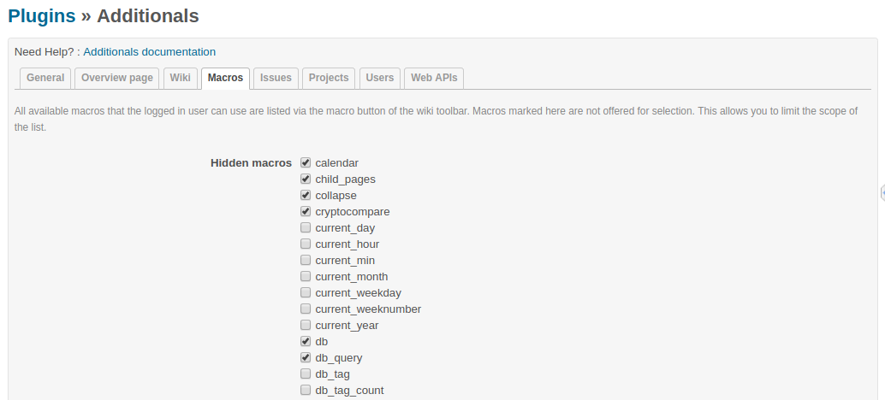
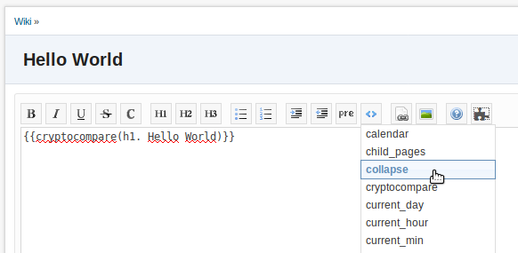
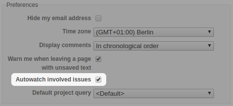

Manual
======

The plugin configuration takes place in the administration area by a user with administration permission. Go to *Plugins / Additionals* to open it.

The additionals plugin configuration is divided into several sections, which are described here.

General section
---------------

The general section tab allows you to define some special behaviours for your Redmine installation.
It is divided into two areas called ``Contents`` and ``Settings``.

Contents
++++++++

The following plugin options are available to be edited by users with administration rights in the area **Contents**:

Text for login page
  This section is for a short information on the login page below the login mask. For example who to contact in order to get Redmine access.

Global sidebar
  Place your global information here, if needed. Use wiki links or available macros that can be seen by every one.

Project wide footer
  In case you want to put some information about your company or for your imprint. Here you can also use wiki syntax for structuring your text.

Settings
++++++++

And the following options can be edited by users with administratios rights in the area **Settings**:

Open external URLs
  Activate the option ``Open external URLs`` in order to open those URLs in a new window or browser tab if someone wants to visit them.

Go to top Link
  Add "Go to top" link. If you have a lot of long pages, it is enabling users to easily return to the top of a page.

Legacy smileys support
  Activate the ``Legacy smileys support`` if you want to use the manual smiley code in your text (e.g. ``:)``). If you already use a plugin that supports Smileys this option should stay deactivated. For more info on Emoji-Browser support read http://caniemoji.com/. Have a look at the Emoji cheat sheet at https://www.webpagefx.com/tools/emoji-cheat-sheet for available Emoji-Codes.

Disable modules
  This feature will hide the selected modules in the project settings. Even if the module is enabled for use in the admin area it can not be selected by the project manager within the projects. Please note, if these modules already activated in existing projects, you will have to change and re-save the respective project settings first.

.. note::
  Please restart the application server, if you make changes to the external urls settings as well as if you activate the Smileys support.

.. note::
  You can use the following manual smiley codes: :), =), :D, =D, :'(, :(, ;), :P, :O, :/, :S, :|, :X, :*, O:), >:), B), (!), (?), (v), (x) and  (/)

Wiki section
------------

If you click on this tab you get to the area, where users with administration rights can customize contents and settings for your Wiki pages in Redmine.
It is divided into two areas called **Contents** and **PDF Wiki settings**.

Contents
++++++++

Changes you can make in the area **Contents** are:

=========================  ===========================================================================================
Field                      Description
=========================  ===========================================================================================
Global wiki sidebar        Here you can implement useful macros like a display of your page hierarchy.
                           But remember - only people with the correspondent rights will get a display of the content.
                           You can also implement useful macros in this section.
                           For example to implement some date or author macros (e.g. last_updated_at, last_updated_by)
=========================  ===========================================================================================

.. note:: Use simple text, macros and wiki syntax for your content.

PDF Wiki settings
+++++++++++++++++

Changes you can make in the area **PDF Wiki settings** are:

=================================  =====================================================================================================
Field                              Description
=================================  =====================================================================================================
Remove Wiki title from PDF view    When activated the general Wiki title info in the page header of the PDF view will not be displayed.
Remove attachments from PDF view   When activated the attachments will not be displayed in the PDF view of a Wiki page.
=================================  =====================================================================================================

Macros section
--------------

Redmine itself and Redmine plugins are sometimes equipped with additional macros for usage. Macros can be used in the Wiki of a project or in the text area of an issue. For more information on how to add macros use the Redmine help documentation.

The *Macros section* of the additionals plugin lists all available macros that the logged in user can use with the *macro button* of the wiki toolbar. If you leave them deactivated they are all available to your users for selection.

Macros marked here are not offered for selection. This allows you to limit the scope of the list for a better usability.

If all macros are deactivated the *Macro button* of the Wiki toolbar will disappear.

.. note:: If you deactivate some macros here this does not mean the user may not implement them. All available macros of installed plugins will work even if they are not part of the macro button. The macro button is just a little helper for Redmine users with no macro experience to make it easier for them to use macros or to remember them.

Macro button for Wiki toolbar
-----------------------------

Many plugins are equipped with a number of useful macros. Unfortunately it is difficult for the normal user to find out which macros are usable without a look at the plugin documentation.

With the macro button for the Wiki toolbar we want to simplify the implementation of macros for users somehow and above all also promote. Because the use of macros belongs to the daily tools of the trade when dealing with the Wiki.

   Figure 2: The Wiki toolbar macro button is a useful helper in order to select available project macros for your content.

The macro button for the Wiki toolbar is acessible for every user of a project. For reasons of clarity, the list of available macros is restricted according to the following criteria.

A user can see in the macro list:

* the macros that can be used for the respective area. Macros that only work in the wiki are not available in the issue area and vice versa.
* The macros, which he / she can use due to his / her role and the associated rights in the respective project.
* only the macros of modules activated in the project. Macros for deactivated functions are hidden in the list.

The function is easy to use. Just click the button with the left mouse. The dropdown list shows all your available macros. Select the one you want to use. The selected macro will be pasted to the cursor position. All you have to do is adapt missing parameters (if needed). That's it.

A list of all available macros provided by the Additionals plugin is also available in this manual.

Issues section
--------------

Here you can define issue rules, which are used in issues of all projects.

Note for new issues
  Use this section if you want to place important issue notes above every new issue (edit mode). Keep it short and use a link to a common wiki page with further information.

.. note:: You can use wiki syntax for your text, but use it wisely. And make sure the wiki page you link to is accessible for every user.

New issue on user profile
  Activate this option in case you want to display the symbol link ''New issue'' on a user's profile page in the top right corner in order to add a new issue for this user directly from it's user profile page.

Show ''Assign to me'' on issue
  Activate this option if you want to display the symbol link ''Assign to me'' in the issue overview page of an issue that you are able to assign it directly to yourself without *editing* the issue. The link is only shown to users who are also members in the correspondent project.

Issue status on sidebar
  Activate this option in case you want to display a list of available issue status options in the right sidebar of the issue view page. One click on the option changes the issue status directly without opening the *edit* mode.

.. note:: All options above only work for users with appropriate issue tracking rights in the administration area "Roles and permissions" (view, create, edit).

Add involved users as watcher automatically
  This means, everyone who is or has been involved in the issue (Assignee, Editor, Author etc.) will automatically be notified about further changes. At the same time the user finds an additional option in his user account edit mode called ``Autowatch involved issues`` (see figure 1). Deactivate this option if you don't want to be notified.

Disallow editing of closed issues (Freeze).
  This option should be activated if already closed issues should no longer be edited and commented.

If "Assignee" is unchanged and the issue status changed from x to y, than the author is assigned to the issue.
  Issues should be automatically assigned to the author, if the status changes to "Approval".

   Figure 1: Deactivate this option in your account in case you don't want to be notified even if the admin activated it.

.. note:: Use Case for this option is that issues should be automatically assigned to author, if the status changes to *Approval*.

Current issue status x is only allowed if *Assignee* is the current user.

.. note:: Is this function used in combination with the setting option *Issue status on sidebar* then the current user will automatically be assigned to the issue while changing the issue status. Use Case here: Users are only allowed to change the status to *In Progress* if they are the person who is actually working on the issue right now.

If ''Assigned to'' is not assigned to a user and the new issue status is x then the issue is auto assigned to the first group with users of the pre-defined role.

.. note:: Use Case: The issue author does not know whom the issue should be assigned to. Or he is unsure who will be responsible for solving the task. In that case the issue for example with the status "To Do" is automatically assigned to the first group, which does contain a user of the pre-selected project manager role. Imagine you have a group called "Support", and there are users assigend to the "Manager" role, this support group will be automatically adressed to solve the issue when the issue author saves it.

Time log for issues required.

.. note:: For each issue of the selected trackers, a time logging is necessary if the issue is to receive one of the defined status properties. The time logging is not required if there does no rights exist for the creation of time logging or if the user has the authorization *Time logging not required*.

Please note, that a user with administration rights will always be able to do all those things a normal user is not allowed to.

Menu section
------------

First of all: This section is only visible in case the *Redmine HRM Plugin* is not installed. If you are also using the *Redmine HRM Plugin* this section disappears because the functionality is also an important part of ''HRM''.
Otherwise, you can define here new top menu items and change some standard settings on the menu behaviour.

.. note:: Please restart the application server, if you remove a menu item or change permissions as well as changing the custom help url.

This area offers you the possibility to add up to 5 additional menu items to your Redmine main menu.
The following input fields are available for each entry:

============  ========================================
Field         Description
============  ========================================
Name          Enter the name of the menu item.
URL           Enter an URL starting with ``http://``
Title         Enter an title (optional)
Permissions   Select one ore more existing roles to which the menu item will be displayed.
              Only members of selected roles will be displayed in this list.
============  ========================================

Settings
++++++++

In the **Settings** area of the menu tab there are the following functions available.

* Enter a ``Custom help URL`` instead of linking to the help on Redmine.org. Make sure you restart your application server after your changes.
* Remove ``My Page`` from top menu in order you don't want your users to use this page.

Web APIs section
----------------

In case you want to use the Gmap Macro you have to implement your Google API Key into the field ``Google Maps Embed API Key`` first. After this you can use the Macro everywhere inside Redmine (Wiki, Issues - everywhere you use wiki syntax).

Help menu
---------

We have implemented a help symbol in the global top menu of the header section that opens the new help menu.

There you find useful manual links to various Redmine related topics which will automatically be implemented, when the plugin has been installed. The menu is divided into two parts.

* There is a menu only for Redmine users without administration rights.
* There is a menu extension for Redmine users with administration rights.

The following menu items are currently implemented if a plugin is installed, that supports this additionals-function:

* FontAwesome icons
* Redmine macros (for more information see: Macros)
* Redmine guide
* Redmine changelog
* Redmine Security Advisories
* Redmine Upgrade

Known external plugins that have a user manual and support this feature are currently:

* additionals
* redmine_automation
* redmine_privacy_terms
* redmine_db
* redmine_passwords
* redmine_hrm
* redmine_reporting

Additionals permissions
-----------------------

The following role permissions are provided by the plugin and must be configured in the administration area ``Roles and permissions`` for the plugin functions to make sure it's working properly.

**According to the selected Role you can activate / deactivate the following option:**

Hide
  This option hides ``members`` of the selected role in the member box of each project overview page. Project members of other roles will still be listed. For example: You don't want others to catch a glimpse of your development team (Role: Development). So activate the role "Developer" to hide the list of your team members assigned to this role in this box. This function is also useful if your member box is too crowded.

.. note:: This setting is also taken into account in all related query lists (e.g. issues, spent time etc.). So that the members with this role are also hidden there. **Important:** If the user has in one project a role, that allows him / her to view a specific "hidden role" this rule is not taken into account anymore.

**According to the selected Role you can activate / deactivate the following permissions:**

Show hidden roles
  Section Project. In case you have hidden roles in a project that should not be displayed in the member box for example you can give to some special user roles the permission to display the members however. *Important:* If someone in a project has a role that has this right, then this user sees all users everywhere even if he or she is user of another project with different roles.

Save dashboards
  Section Project. Allow this user role to add, edit or delete dashboards of their own. So this users can add dashboards for every purpose they want and switch between them.

Set system dashboards
  Section Project. This permission requires *Save dashboards* permission. If you activate it, you allow users with this permission to change the system wide dashboard. Those user may create dashboards and make them system default. They get additional options: *Visible*, *System default* and *Always expose*.

Share dashboards
  Section Project. Allow user roles with this permission to share dashboards with other users. This means if someone else assigns you a dashboard via *Author* selection, you are allowed to edit those dashboards as long as you are the assigned *Author* and also have the permission to *Save dashboards*.

Edit issue author
  Section Issue tracking. This permission will always record any changes made to the issue author. You can change the author only in the issue edit mode. This function replaces the use of external plugins (e.g. change_author)

Edit closed issues
  Section Issue tracking. Set this option to those roles you do not want to edit closed issues. Normally a closed issue should not be edited anymore.

Set author of new issues
  Section Issue tracking. This permission should be set carefully, because in case you allow this, there is no history entry set for this. You will never know if the author has been originally someone else. Normally you don't want this.

Log time to closed issues
  Section Time tracking. Our plugin does not allow time logs to closed issues. In case you still want to allow your members to log time to closed issues, you need to change the permission here.
