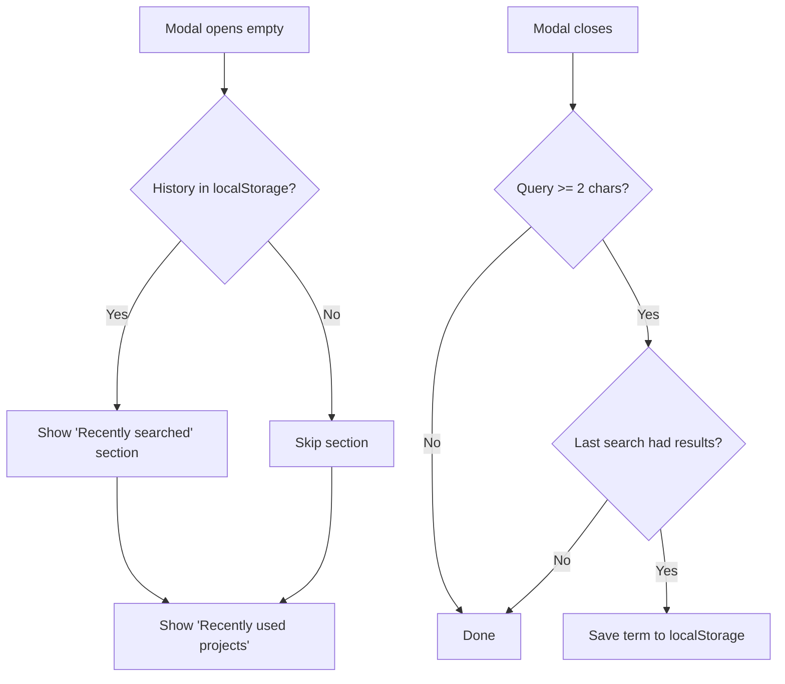

# Global Search History via localStorage

## Overview

Add a "recently searched" section to the global search modal (Cmd+K) that
persists search terms in the browser's localStorage. No backend changes needed.



## Data Model

- **localStorage key**: `global_search_history`
- **Format**: JSON array of strings, most recent first
- **Max entries**: 15 (constant `MAX_HISTORY_ENTRIES`)
- **Deduplication**: Case-insensitive, newer entry replaces older
- **Min length**: 2 characters (consistent with search minimum)

## Save Trigger

The search term is saved when the modal is left, but only if:

1. Query in input >= 2 characters
2. The last search returned results (`this.hasResults` flag)

`saveCurrentQuery()` is called from:

- `close()` - Escape, overlay click, Cmd+K toggle
- `openSelected()` - Enter key, before `window.location.href`
- Click on result link - before browser navigation (main use case)

## UI Layout (empty modal)

```text
+------------------------------------------+
| Search Cmd+K                             |
+------------------------------------------+
|                                          |
| Recently searched            Clear all   |
|   redmine api                            |
|   burndown chart                         |
|   wiki macro                             |
|                                          |
| Recently used projects                   |
|   AlphaNodes                   Project   |
|   Redmine Reporting            Project   |
+------------------------------------------+
```

- Section header with "Clear all" link aligned right
- Click on term: fills input + runs search immediately
- "Clear all": clears localStorage + removes section from DOM
- No individual delete buttons (X) per term
- No history: section is omitted entirely

## Affected Files

### JavaScript - `global_search_controller.js`

- Constant `MAX_HISTORY_ENTRIES = 15`
- `this.hasResults` flag, set in `renderResults()`
- `saveCurrentQuery()` - read, deduplicate, trim, write localStorage
- `getSearchHistory()` / `clearSearchHistory()` - localStorage access
- `close()` - call `saveCurrentQuery()`
- `openSelected()` - call `saveCurrentQuery()` before navigation
- Click handler on result links - `saveCurrentQuery()` before navigation
- `loadInitialContent()` - render history section before projects
- `renderHistorySection()` - generate HTML for history section
- Click on history term: fill input + `performSearch()`
- "Clear all": `clearSearchHistory()` + remove section from DOM

### CSS - `global_search.css`

- `.global-search-section-header` - extend with flexbox for "Clear all" link
- `.global-search-clear-link` - styling for the "Clear all" link

### Locales - `config/locales/*.yml`

- `label_global_search_recent_searches`
- `label_global_search_clear_all`
